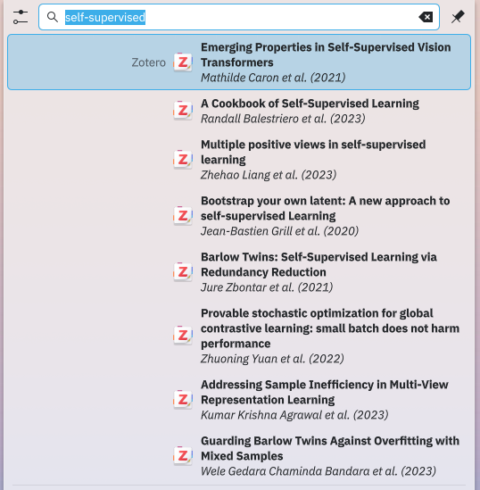

KRunner Zotero plugin
=====================


Search through your [Zotero](https://www.zotero.org/) papers based on metadata as well as notes, tags, etc.,
via KDE Plasma's awesome [KRunner](https://userbase.kde.org/Plasma/Krunner).
Inspired by [ZotHero](https://github.com/deanishe/zothero).
<div align="center">
    
</div>

## Installation
1. Clone this repository
    ```
    git clone https://github.com/tran-khoa/krunner-zotero.git
    ```
2. Install the plugin
    ```
    cd krunner-zotero
    ./install.sh
    ```
3. (optional) Set plugin as favorite
    ```
    System Settings -> Search -> Plasma Search -> Configure -> Star the plugin
    ```
   
## Usage
Fire up KRunner and start typing anything.
The plugin will search through your Zotero library based on
- Title and short title
- Authors
- DOI
- Year
- Tags
- Collections
- Notes
- Abstract
- and the 'publisher' (or Journal Abbreviation, Conference Name, Proceedings Title, etc.)
